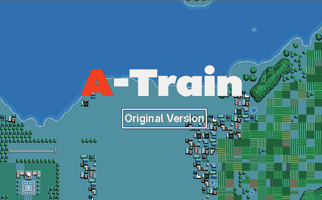
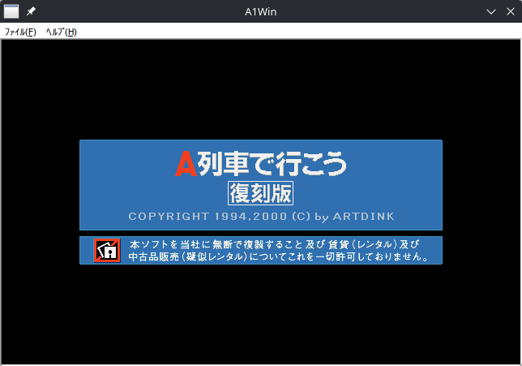
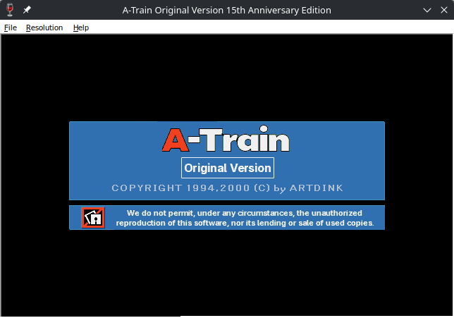
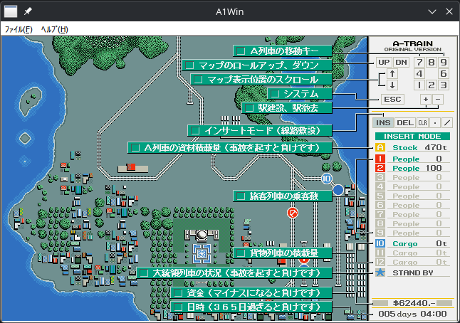
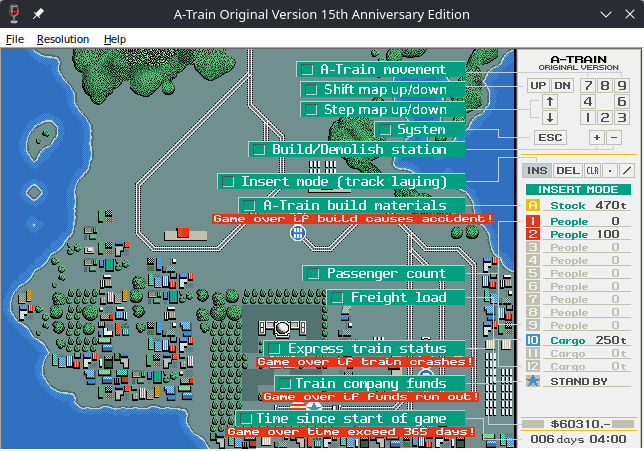
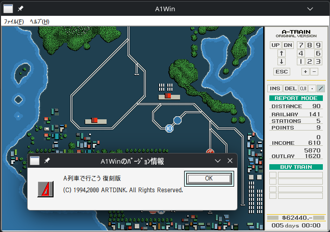
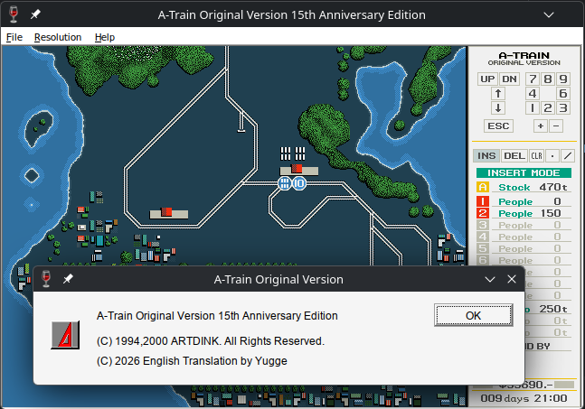
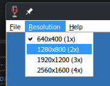
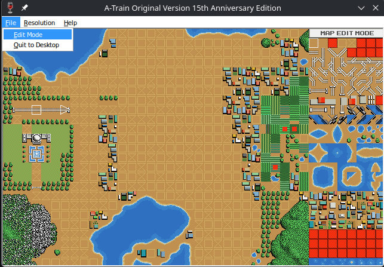
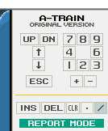

# A-Train Original Version English Translation
This repository contains the English translation of A列車で行こう 復刻版 (A ressha de ikou fukkokuban) 15th anniversary edition, a popular game developed by ARTDINK for Win 95/98. The translation aims to provide a faithful and accurate representation of the original Japanese text, ensuring that players can enjoy the game in their native language.

The project is open-source and welcomes contributions from the community. If you are interested in helping with the translation or have any questions, please feel free to open an issue on GitHub to discuss.

## What is translated?
The translation covers the following sections:
- Title screen
- Dialogs
- Warning messages
- Menubar
- Help screens
- Ending Messages

### Examples of translation
| Original                                        | Translation                                       |
|-------------------------------------------------|---------------------------------------------------|
|    |     |
|    |    |
|  |  |

## Quality of life improvements
### Resolution scaling

The original game uses a resolution of 640x400 pixels, which is incredibly small for a game that is meant to be played on a large screen like we have today. The patch introduces 2x to 4x scaling so that you can enjoy the game on a modern display.

### Edit mode

Edit mode existed in the original game, but hidden behind a cheat code: `Enter [\] in order to trigger it`. Since the combination can be hard to do on an international keyboard it was changed to `1,2,3 in order`. It was also added as a menu option under the File dialog, to easier access it.

## Miscellaneous

### Name choice

While A列車で行こう 復刻版 literally translates to "Take the A Train Reissue" the title "A-Train Original Version" was chosen for this translation. This is because the game uses this name many times when representing the game using latin letters. Therefore, I believe it is ARTDINK's preferred international name.

### Using the translation
- Grab the latest release from the [releases page](https://github.com/maspling/a-train-english-translation/releases) and extract the files to the same folder as the original game.
- Use [JS Patcher](https://www.marcrobledo.com/RomPatcher.js/) to apply the patch on the A1Win.exe file using the patch file provided in the release.

### Building the translation from source
- Build the patcher using `go build .`
- Copy the patcher (named `a1patch.exe` or equivelent in other architectures) to the same folder as the original game.
- Copy the edit folder to the same folder as the original game.
- Run the patcher by double-clicking on it, or using the command line.
- A new folder named "translation_files" will be created in the same folder as the original game, this folder contains the translated files.
- Copy the files from the "translation_files" folder to the original game folder, overwriting the original files to finish the patching process.

### Credits and Shoutouts
- [ARTDINK](https://www.artdink.com/) - Original game developer, still around, still making A-train, go support them!
- [MrRichard999](https://gbatemp.net/download/a-ressha-de-ikou-md-english-translation-patch.36975/) - Lead the translations of the Console versions
  - [Mega Drive Translation](https://gbatemp.net/download/a-ressha-de-ikou-md-english-translation-patch.36975/)
  - [Famicom Translation](https://gbatemp.net/download/a-ressha-de-ikou-a-train-english-translation-patch-for-the-nes-famicom.36944/)
